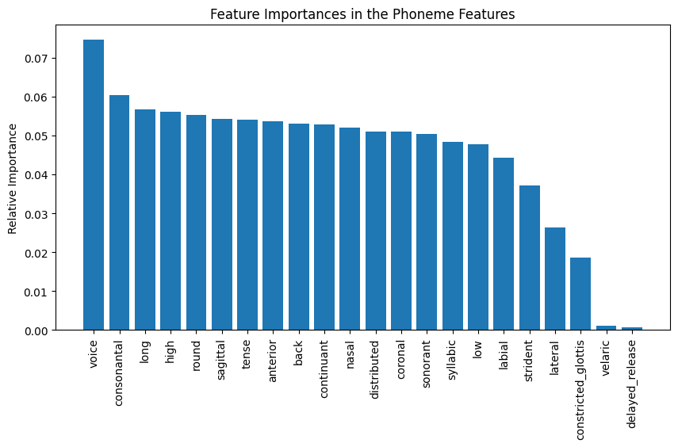

# Speech Accent Analysis

by Dastan Abdulla

## 1. Introduction
The study of language variation and its relationship to a speaker's native language and country of origin has significant implications across multiple domains, including sociolinguistics, language policy, education, and social integration. By examining the phonetic, lexical, and syntactic features of English as a second language, we can gain valuable insights into the ways in which a speaker's linguistic background influences their acquisition and use of English. This project aims to explore the predictive power of these linguistic features in determining a speaker's native language and geographical origins, which can contribute to our understanding of language variation and change as well as understanding social integration of multilingual individual in English dominated speech communities.

## 2. Background
Previous studies that have attempted to address this task have acknowledged the inherent challenges, with reported performances averaging around 67% accuracy [[paper](https://arxiv.org/pdf/1811.05540)]. However, it is important to note that these studies included a limited sample of eleven different ethnic non-native speakers, which may not provide a sufficiently representative dataset considering the existence of approximately 650 ethnic groups across 190 countries [[source](https://www.washingtonpost.com/news/worldviews/wp/2013/05/16/a-revealing-map-of-the-worlds-most-and-least-ethnically-diverse-countries/)]. To obtain more conclusive results, future research should aim to incorporate a more diverse and statistically significant representation of ethnic non-native speakers.
## 3. Data sourcing.
The Complete Speech Accent Archive is a comprehensive dataset containing speech samples from a diverse range of speakers. Each speaker in the archive was asked to recite the passage found in [sample_read.txt](https://github.com/Data-Science-for-Linguists-2024/Speech-Accent-Analysis/blob/main/data_samples/sample_read.txt)
The dataset is accompanied by a spreadsheet named [speakers.xlsx](https://github.com/Data-Science-for-Linguists-2024/Speech-Accent-Analysis/blob/main/data_samples/speakers.xlsx) which provides detailed information about each speaker.
Dr. Weinberger has confirmed that the dataset is licensed under a Creative Commons license, allowing me to share it with proper attribution. However, due to the dataset's size, I have only included a representative sample in the "/data_samples" folder.
## 4. Data cleanup
I started by ensuring that the audio and transcription files were present in the dataset. While most of the files were available, I had to make numerous corrections to address typos, mistakes, and inconsistent formatting across the dataset. To standardize the data, I decided to use ISO standard conventions for normalization, particularly for language and country names, which required significant effort.  
To assist with the normalization process, I utilized the pycountry library (although it's not really a library per se, it's more like a middleware to access a database) in Python. 

Initially I attempted to convert the RTF transcribed files into textfiles using a built Python library RTF parser, however, that led to issues with the byte level parsing of the files and encoding issues. I had to find an alternative solution to convert the RTF transcription files to the TXT format.  

I reached out to professor Na-Rae Han as my research efforts into the issue did not pan out, and she introduced me to a tool called Pandoc, which proved to be an effective solution for this task. Pandoc is a versatile command-line utility that enables the conversion of files from one markup format to another. It supports a wide range of formats, including RTF, TXT, HTML, Markdown, and many more. By leveraging Pandoc's capabilities, I was able to successfully convert the RTF files to the desired TXT format, ensuring compatibility with the subsequent steps in my workflow. Pandoc's extensive format support and ease of use make it an invaluable tool for anyone working with various document formats and in need of reliable conversion options. The Pandoc script that I utilized is found under [rtf_to_text_script.sh](https://github.com/Data-Science-for-Linguists-2024/Speech-Accent-Analysis/blob/main/data_samples/rtf_to_text_script.sh)
which essentially converts all the files in the `transcriptions` directory from RTF to textfiles and dumps all of them in a new `transcriptions_text` directory.
### Added Value
To enhance the dataset with additional information, I cross-referenced the languages (after standardization) with Glottolog 5.0, a powerful resource that allowed me to extract continent information for each language. Glottolog 5.0 proved to be an extremely valuable source, offering the potential to trace down dialects and language families. However, I ultimately decided against pursuing this avenue, as it became extremely convoluted.  
Later on in the project timeline, I also incorporated latitude and magnitude information for each country by using Googles' [countries.csv](https://developers.google.com/public-data/docs/canonical/countries_csv) published dataset, in the hopes of incorporating these to build a regression based prediction model.
## 5. Analysis
### Task I: Language Prediction
For this task, I tried to use three different models based on 3 different kinds of features:
- Phoneme Feature Distributions (Parsed from Panphon)
- The Transcription Phoneme Tokens (TFIDF-Vectorizer)
- The Audio Recording Features (Extracted from `librosa`)
#### Phoneme Feature Distributions 
The first model that I tried for this was Random Forests (about 20 numeric columns as features)
```python
RandomForestClassifier(n_estimators=100, random_state=42)
```  
The most informative features  


- We can see that the most informative feature for the model was `voice` which refers to phonetic vocality. This suggests that the presence or absence of voicing in phonemes plays a significant role in distinguishing between different native language backgrounds. The distinction between voiced and voiceless phonemes varies across languages, and this variation can influence how speakers of different native languages produce phonemes when speaking English as a non-native language, thus it makes sense for the model to find this to be the most informative feature from a linguistics perpsective.

#### The Transcription Phoneme Tokens 
The model for this was based on using the transcription phonemes directly. I created a custom tokenizer function for the phonemes that removes all the whites spaces, and looks and each token character individually.
```python
def phoneme_tokenizer(transcript):
    no_whitespace_transcript = transcript.replace(' ', '')
    return [*no_whitespace_transcript]
``` 
Then I used that function to create a `TfidfVectorizer`
```python
TfidfVectorizer(max_df=0.5, max_features=1500 , tokenizer=phoneme_tokenizer, lowercase=False, token_pattern=None, ngram_range=(1, 3))
```
Where the `(1, 3)` for the `ngram_range` specifies trigrams for the best accuracy.  
- Note that I did try the lower level ngrams but they were ultimately unable to compete in terms of performance to the other 2 models.
Then for the actual model itself, I used Multinomial Naive-Bayes (`MultinomialNB()` in python) so that I can peak at the most informative features at least.
The most informative features (or at least some of them) were:
```
Top features for class 0: ['h ɜ', '̚', 'ɛ ̆', '̆ n', 'ɛ ɪ', 'z θ', 'i ŋ', 'ə ʊ', 'ə n', 'ŋ z ̥']
Top features for class 1: ['ɛ ː', 'ɛ n', 'h ɛ', 'l ˠ', 'ˠ', 't ʊ', 'ː s', 'i ː s', '˺', 'ɔ l ˠ']
Top features for class 2: ['r', 's t ̪', '̪ ɪ', 'ɪ s', 't ̪ ɪ', 'ɝ', 'h ɝ', '̪ ɪ ̃', 'ɪ s t', 'ɔ f']
Top features for class 3: ['ə ɹ', 'h ə ɹ', 'ɝ', 'h ɝ', 'r', 'h ə', 'ə ɹ b', 'f ɔ ɹ', 'ɹ b', 'ŋ z ̥']
Top features for class 4: ['s ̪', 'r', 'ʔ', 'e s', 'i k s', 'ɜ ɹ', 'z t', 'k i d', 'i d ̥', 'k i']
Top features for class 5: ['̞', 'æ ̞', 'a ̃ n', 'a ̃', 'z ̥ s', 'ɪ ̆', 'ɔ v', 'z ̥ ɔ', 'k a', '̥ ɔ']
Top features for class 6: ['r', 'x', 'x ɜ', 'ɛ s t', '̱', 'ɛ s', 's t ̪', 's ɔ', 'r b', 'x ɛ']
Top features for class 7: ['r', 'h ɛ r', 'ɛ r', 'd ̥ e', 't u ̆', 'h ɜ', '̥ e', 'd ̥', 's ɪ ̃', 'u ̆']
Top features for class 8: ['ʈ', 'r', 'h ɜ', '̪ i', '˺', 't ̪ ɪ', '̝', 'l a', 'ʰ i', 'd ̪ i']
Top features for class 9: ['̪ ɪ', 'r', 'v i', 't ̪ ɪ', 'h ɝ', 'ɝ', 'v ɪ', 'ɛ r', 'n d', '˞']
```
- Note that for the task of distinguishing between languages, there are over 120 distinct classes or labels, each with their own set of informative features.
- But based on the output, we can see that we are not overfitting since the classes for the most part have unique trigrams and there isn't a lot of reptition.
#### The Audio Recording Features
When it comes to the audio features, I used a library called `librosa` which extracts the numeric Mel-frequency cepstral coefficients (MFCC) which are treated as the features.
The model that was used for this was, again, random forests, since it does not really make sense to look at the informative features for the audio.
```python
RandomForestClassifier(n_estimators=100, random_state=42)
```  
### Task I: Model Comparisons

- We can see that almost all three variations performed relatively the same. However, when it comes to the space complexity of each, it is a slightly different story.
- Phoneme Feature Distributions : (1174, 22) = 25,828
- The Transcription Phoneme Tokens : (1174, 1500) = 1,761,000
- The Audio Recording Features: (2923, 21) = 61383
The reason why the x dimension for the audio features is much higher than the others is because I used the entire dataset since we don't really care about the transcription part for that model.  
We can very clearly see that while, the trigram phoneme features performed relatively well, they take up the most space at a whopping 1174*1500 = 1,761,000 entry samples.
Overall all the models for the top_k=1 had about 25% accuracy which may seem low, but considering the baseline guessing accuracy for this task and our dataset's unique labels was (1/124=0.08%), our model was able to learn a lot about training data.
### Task II: Country Prediction
For this Task I tried to create two models:
- Direct Approach (using a multi-label classifier)
- Custom Regression Model (using latitude and longitude to find the closest matching country)
#### Direct Approach
For the direct approach, I used a simple random forest classifier using the phoneme distribution as the features (since it was the most compact space wise).
```python
RandomForestClassifier(n_estimators=100, random_state=42)
```  
The model was able to achieve 21% accuracy, which may seem low, but considering that our guessing accuracy was (1/159=0.063%), the model was able to pick up and learn informative features by a substantial amount.
#### Custom Regression Model:
```
+----------------+   +------------------+    +------------------+
| Panphon        |-->| Regressor        |--->| Predicted        |
| features       |   | longitude        |    | longitude        |
+----------------+   +------------------+    +------------------+
    |                                                 |
    |                                                 v
    |                                        +-----------------+
    |                +------------------+    | (pred lat,      |
    +--------------->| Regressor        |--->|  pred long)     |
                     | latitude         |    |                 |     +------------------+
                     +------------------+    +-----------------+ --> | Actual           |
                                                                     | prediction       |
                                                                     | Search for       |
                                                                     | closest country  |
                                                                     +------------------+
```
The custom regression model did really poorly unfortunately, achieving an accuracy of 0.004% which is worse than our baseline guessing accuracy. The reason for this is because when we look at the MSE for each the latitude and longitude regressors, we have 
```
Latitude 	MSE: 433.87571918958554	R2: 0.053577876284328085
Longitude 	MSE: 3937.92735784482	R2: 0.22379898619175476
``` 
Note that the R2 and R1 are very close to 0 (if we wanted strong correlation it'd be either close to 1 or -1), which means that there is almost no correlation between the features we are trying to use and the predictions we are trying to make. Maybe if we had more accurate coordinate representation (such as cities), then the accuracy would improve, but just generalizing it to country right now is not sufficient to build the regression models.
## 6. Conclusion
In conclusion, this project has demonstrated the inherent challenges and complexities involved in predicting a speaker's native language and country of origin solely based on their spoken English audio samples. Despite the difficulties, our models have shown promising results, indicating that this task, while arduous, is not entirely impossible.  

Through the exploration of various linguistic features, including phoneme distributions, transcription phoneme tokens, and audio recording features, we have gained valuable insights into the ways in which a speaker's native language influences their English pronunciation. The models trained on these features have significantly outperformed the baseline guessing accuracy, highlighting their ability to learn and identify informative patterns in the data.  

Despite the lower accuracy in country prediction, the language prediction models have shown encouraging results. The fact that our models were able to learn and identify distinguishing features among the 124 unique language labels in the dataset is a testament to the potential of these approaches. It is important to recognize that even small improvements over the baseline accuracy can have significant implications in real-world applications, such as language education and speech recognition systems.  

Moving forward, there is ample room for further research and refinement in this domain. Incorporating more diverse and representative datasets, exploring advanced machine learning techniques, and considering additional linguistic features could potentially enhance the accuracy and robustness of the models. Additionally, investigating the role of dialects, language families, and other sociolinguistic factors could provide deeper insights into the complexities of language variation and its impact on speech accent analysis.  

In summary, while predicting a speaker's native language and country of origin from their spoken English is a challenging task, this project has demonstrated that it is not an insurmountable one. The models developed here have showcased the potential for learning and identifying informative linguistic patterns, paving the way for further advancements in this field. By continuing to explore and refine these approaches, we can contribute to a better understanding of language variation and its implications for various domains, ultimately fostering more effective communication and cultural understanding in our increasingly globalized world.

